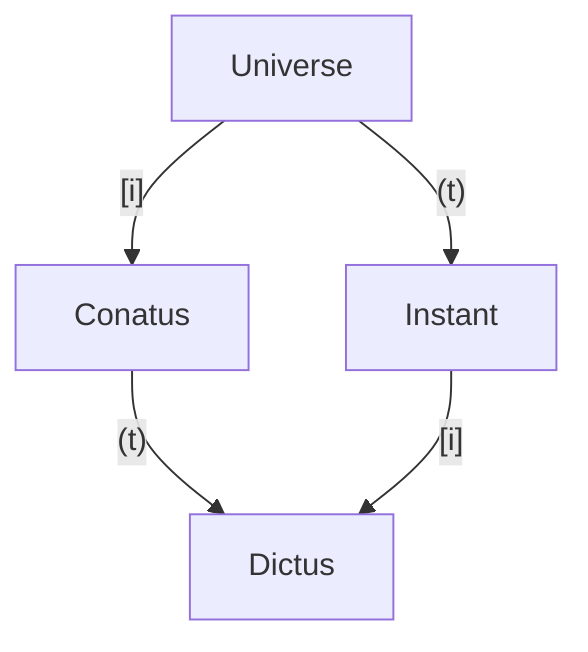

# Notes about [Philosophy of Leibniz][leibniz-physics]
Cartesian Physics: moment by moment

Hobbesian notion of conatus: the beginning and end of motion
Theoria motus abstracti (TMA): continuity of conatus
Hypothesis physica nova (HPN): TMA + real world discontinuities described by Huygens-Wren Laws of Impact

> Leibniz argues that the motion of a body in isolation is determined entirely by its own conatus, and that the motions of colliding bodies are determined solely by the combination of their respective conatuses.

> A pebble striking a planet will thus fail to have any significant effect because the pebble’s velocity is propagated to the planet not at a single blow but particle by particle. Its motion is consequently diluted – and even reversed – as it is repeatedly summed with the velocity of each subsequent particle.

## 2.2 The critique of Cartesian corpuscularianism
Cartesian corpuscularianism: the whole essence of matter is extension, a geometrical region made concrete

> Leibniz, in effect, argues that the thesis that the whole essence of matter is extension saddles Cartesians with a dilemma: they must either hold that the laws of motion are grounded in the nature of extension, or that God acts directly to bring about the lawful regularities that are observed in the world.

## 2.3 The passive powers of bodies

> As we noted above, the physics of the TMA assigns to bodies no resistance to motion, and thus predicts that under idealized conditions it should be no harder to move something massive than something minuscule. In distancing himself from this early view, Leibniz comes to argue that, in fact, matter “resists being moved through a certain natural inertia it has … so that it is not indifferent to motion and rest, as is commonly believed, but requires more active force for motion in proportion to its size” (G IV.510/AG 161)

> In addition to offering resistance to motion, Leibniz thought it essential to bodies that they resist mutual collocation – to some degree, they must be “solid” or impenetrable. In attributing solidity to bodies, Leibniz rejects the Cartesian suggestion that impenetrability simply follows from the property of a body’s being extended. For, Leibniz argues, it could be the case that a body’s solidity is due to a body’s having a certain reluctance – but not an unconquerable one – to share a place with another body, and thus he implies that it is, for example, at least conceivable that two bodies might be forced to overlap in much the same way that we generally imagine bodies and regions of space to coincide (NE, Book II, Ch. iv).

If the equations say so, bodies overlap. We need to resolve impenetrability with the bodies' own reluctance to overlap, not by their mere extension.

> From this, it is obvious that extension is not an absolute predicate, but is relative to that which is extended or diffused, and therefore it cannot be separated from the nature of that which is diffused 

Objects exist as individual data structures.

>  Leibniz proposes to explain physical extension in terms of solidity – a body isn’t solid because it is extended, it is extended because it has the ability to exclude other bodies! 

## 3. Leibniz’s Dynamics

## 3.1 A Brief Demonstration

Galileo’s Law: the distance traveled by a falling body is directly proportional to the square of the time it falls (i.e. d = at2 where a is a constant)

Cartesian view was conservation of "quantity of motion" ( $mv$ momentum); leibniz vew was about "quantity of force" ( $mv^2$ energy)

Dead force: what we'd call a force now
Live force: what we'd call an impulse


## 3.3 Forces and Metaphysics

primitive vs derivative forces

## 4. Leibniz on the Laws of Motion

## 4.2 A system of conservation principles

- conservation of relative velocity: $V_a - V_b$ is conserved
- conservation of quantity of progress: $m_a V_a + m_b V_b$ is conserved
- conservation of living force: $m_a V_a^2 + m_b V_b^2$ is conserved

## 5.1 Against Absolute Space and Time

the balls _don't_ have an existence that is inherent to their location on the canvas
the collisions happen in a data structure, their location in space and time is relative
just a viewport

> According to Leibniz, space and time are not so much things in which bodies are located and move as systems of relations holding between things.


# TODO: read [Descartes' Physics][descartes-physics]

# TODO: read [Newton’s Views on Space, Time, and Motion][newton-stm]

# API and Data Design

We need SoA to be able to operate efficiently, nonetheless we would like to pretend or present views that act like they're AoS instead -- so we'll define proxy objects that just hold a reference to the parent universe and the key. But also a polymorphic 'actualized' version for temporary storage when moving objects.

Everything is a polynomial of time-since-epoch.
Do we keep track of the past, or discard it? Could keep a buffer of retired 'realized' Conatara/Conati.


```py
class RefConatus:
  key: (primary key)
  birth: (first moment valid)

  epoch_position -> universe.positions[key]
  epoch_velocity -> universe.velocities[key]
  acceleration -> universe.accelerations[key]

  radius -> universe.radii[key]
  mass -> universe.masses[key]
  restitution -> universe.restitutions[key]
  friction -> universe.frictions[key]
```

when accessing, must specify an instant in time in order to resolve the Conatus to a (Dictus?) that "says where the object is right at that moment". I think that'll be the parens operator?




[leibniz-physics]: https://plato.stanford.edu/entries/leibniz-physics/
[descartes-physics]: https://plato.stanford.edu/entries/descartes-physics/
[newton-stm]: https://plato.stanford.edu/entries/newton-stm/